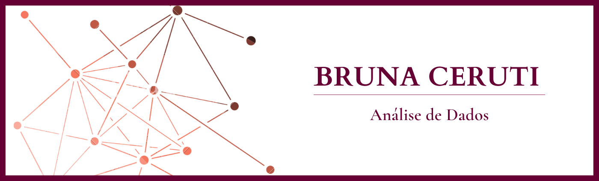

   

  

# Bruna Ceruti
Sou Engenheira por formação e tenho experiência de 8 anos trabalhando no mercado de Oleo e Gás. Atuando nesse segmento, sempre fui muito interessada em estruturar e tornar processos mais eficientes e também aprender como eles funcionam, de forma aliada à tecnologia. Para mim o acesso a informação de todos dentro de uma organização é fundamental para tomada de decisões estratégicas acertadas e a área dados é uma ferramenta chave para levar a informação correta, precisa e de forma segura para os usuários e gestores da organização. 
Meu principal objetivo é contribuir em projetos em diferentes áreas do conhecimento, aprendendo sempre e conectando pessoas através da análise e engenharia de dados.

**Links:**
* [LinkedIn](https://www.linkedin.com/in/bruna-ceruti/)
* [Medium](https://medium.com/@brunnagomess)
* [Instagram](https://www.instagram.com/brunaceruti/)

Convido a você a se conectar comigo nas demais redes para acompanhar as minhas publicações sobre a área de dados.

## Análise de Dados:

* **SQL Analytics - Integrando o MySQL com o PowerBI**
  * Artigo no Medium - https://bit.ly/3INmXAn
  * Dashboard - https://bit.ly/3AYyHNT

* **Criando Dashboard a partir de dados obtidos com o Google Analytics**
  * Artigo no Medium - https://bit.ly/3t4tBff
  * Dashboard - https://bit.ly/3Bxf939
---
